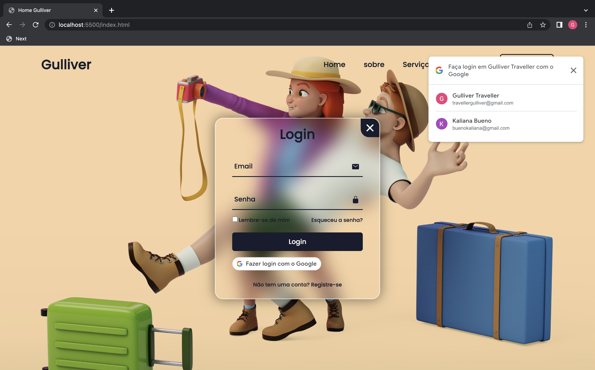

# GULLIVER - LOGIN COM O GOOGLE



## Índice

- <a href="#Descrição">Descrição</a>
- <a href="#Linguagens">Linguagens utilizadas</a>
- <a href="#rodar">Como rodar?</a>


## Descrição
Integração da API de Login com o Google para o Projeto Gulliver Traveller.

## Linguagens utilizadas
- [x] HTML
- [x] CSS
- [x] JAVASCRIPT

## Como rodar?
```bash

# Clone este repositório

# Execute a aplicação

# A aplicação será inicializada ma porta 5500, acesse pelo navegador: http://localhost:5500/index.html

```
